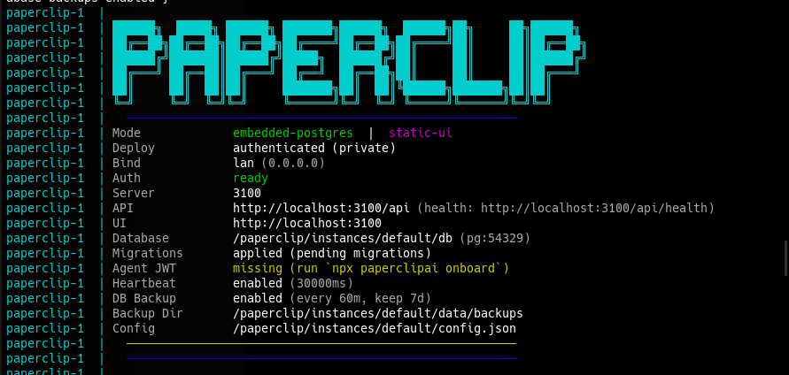

# AI Services Reinstall Guide

Step-by-step guide to reinstall all AI-related services on a fresh Ubuntu setup.

## Hardware Reference

| Component | Spec |
|---|---|
| CPU | AMD Ryzen 9 5950X |
| RAM | 32GB 3600MHz |
| GPU | GeForce RTX 4080 SUPER 16GB |
| Motherboard | Aorus X570 Elite |
| OS Drive | Samsung SSD 990 PRO 2TB (500GB Ubuntu / 1.3TB Windows / 200GB Bazzite) |

> This guide targets the **Ubuntu** partition (500GB). Ubuntu 26.04 LTS ("resolute") ships only Python 3.14 by default — see Section 7.1 for why a second Python version is needed for CrewAI.

---

## 1. NVIDIA Driver & CUDA Setup

Install the latest recommended NVIDIA driver:

```bash
sudo apt update
sudo ubuntu-drivers autoinstall
sudo reboot
```

Verify the driver installation:

```bash
nvidia-smi
```

Install the CUDA Toolkit (latest version, via the official NVIDIA repository):

```bash
# Follow the official instructions for your Ubuntu version:
# https://developer.nvidia.com/cuda-downloads
```

Verify CUDA:

```bash
nvcc --version
```

---

## 2. Ollama Installation

Install Ollama:

```bash
curl -fsSL https://ollama.com/install.sh | sh
```

Verify the service is running:

```bash
systemctl status ollama
```

### 2.1 Model Storage Location

Models downloaded via `ollama pull` are stored at:

```
/usr/share/ollama/.ollama/models
```

### 2.2 Reinstalling Models

Pull each model back down:

```bash
ollama pull qwen3-coder:30b
ollama pull qwen3.8:27b
ollama pull qwen2.5-coder:14b
ollama pull gpt-oss:20b
ollama pull deepseek-r1:14b
ollama pull gemma4:26b
ollama pull gemma4:12b
ollama pull qwen3:14b
```

Plus one model pulled via Hugging Face GGUF instead of the Ollama library (used by Hermes Agent, Section 9):

```bash
ollama run hf.co/bartowski/NousResearch_Hermes-4-14B-GGUF:Q4_K_M
```

Verify installed models:

```bash
ollama list
```

---

## 3. Open WebUI (Docker)

> **Why Ollama stays native and isn't dockerized:** with a dedicated NVIDIA GPU, native Ollama uses the system driver directly with zero extra config. Dockerizing it would require installing and maintaining the NVIDIA Container Toolkit just for GPU passthrough, with no real benefit on a single-machine setup. Open WebUI itself doesn't touch the GPU (it's just the web interface), so only it needs to be containerized — the NVIDIA Container Toolkit step is skipped entirely.

### 3.1 Install Docker

Using Docker's official install script (simpler than the manual apt-repository method, works across distros):

```bash
curl -fsSL https://get.docker.com -o get-docker.sh
sudo sh get-docker.sh
```

Allow running Docker without `sudo` (optional but recommended):

```bash
sudo usermod -aG docker $USER
```

> Log out and back in (or restart the terminal/session) for the group change to take effect.

Confirm the Docker service is running and enabled to start on boot:

```bash
sudo systemctl status docker
sudo systemctl is-enabled docker   # should say "enabled"; if not: sudo systemctl enable docker
```

Verify Docker:

```bash
docker run hello-world
```

### 3.2 Run Open WebUI

Since Ollama runs natively (not in Docker), Open WebUI is run with `--network=host` so the container shares the host's network stack and can reach Ollama directly at `127.0.0.1:11434` — no port mapping or `host.docker.internal` needed on Linux.

```bash
docker run -d \
  --name open-webui \
  --network=host \
  -v open-webui:/app/backend/data \
  -e OLLAMA_BASE_URL=http://127.0.0.1:11434 \
  --restart always \
  ghcr.io/open-webui/open-webui:main
```

Access the interface at:

```
http://localhost:8080
```

> Note: `--network=host` is Linux-specific and is why the port is 8080 directly (no `-p` mapping) rather than remapped to 3000 as on Mac/Windows setups.

### 3.3 Verify

```bash
docker ps
docker logs open-webui
```

### 3.4 LAN Access (other devices at home)

Find the machine's local IP:

```bash
ip addr show | grep "inet " | grep -v 127.0.0.1
```

From another device on the same network, open `http://<LOCAL_IP>:8080`. If it doesn't connect, check the firewall:

```bash
sudo ufw status
sudo ufw allow 8080/tcp   # if ufw is active and the port isn't allowed
```

> Consider setting a DHCP reservation for this machine on the router so the local IP doesn't change on reboot.

### 3.5 Remote Access (internet)

Not yet configured. Preferred approach when needed: a VPN (e.g. Tailscale) rather than a public reverse proxy — no ports exposed to the internet, simplest to set up for personal use.

### 3.6 First Login & Users

The first account created at `http://localhost:8080` becomes the admin automatically. Additional users (e.g. family members) are added manually via *Admin Panel → Users → Add User*. The "email" field is required as a login identifier but doesn't need to be a real, working address (e.g. `name@family.local` works fine — nothing is sent to it).

---

## 4. Post-Install Checklist

- [ ] `nvidia-smi` shows the RTX 4080 SUPER correctly
- [ ] `ollama list` shows all 8 models
- [ ] `sudo systemctl is-enabled docker` returns `enabled`
- [ ] Open WebUI loads at `http://localhost:8080`
- [ ] Open WebUI can see and query the Ollama models
- [ ] GPU usage confirmed during inference (`nvidia-smi` while running a prompt)
- [ ] Open WebUI reachable from another device via `http://<LOCAL_IP>:8080`
- [ ] Admin account created; additional family user accounts added

---

## 5. Mem0 — Agent Memory Layer (venv, Graph Memory)

Gives agents (starting with CrewAI) persistent memory: a vector store (Qdrant, embedded/local) for semantic recall plus a graph store (Neo4j) for entity/relationship memory. Runs as a Python library inside a dedicated venv — not the official Docker server bundle, since that bundle only supports OpenAI/Anthropic/Gemini out of the box (see Pending list below). Fully local via Ollama.

### 5.1 Create the venv and install Mem0

```bash
mkdir -p ~/Projects/AI/ai-agents/mem0 && cd ~/Projects/AI/ai-agents/mem0
python3 -m venv venv-mem0
source venv-mem0/bin/activate
pip install mem0ai ollama neo4j langchain-neo4j python-dotenv
```

> Note: as of `mem0ai` 2.2.0, the `[graph]` install extra was dropped — the `neo4j`/`langchain-neo4j` packages must be installed manually, as above. The `ollama` package (official Python client) is also required separately for the Ollama embedder to work.

> **Watch out — `mem0ai[extras]` is not for fastembed/BM25.** It's a bundle for cloud vector-store integrations (AWS Bedrock, OpenSearch, Elasticsearch) and pulls in `boto3`, `elasticsearch`, `opensearch-py`, plus older `langchain`/`langchain-community` packages. If `langgraph`/`langchain-neo4j` are installed in the same venv, this downgrades `langchain-core` and breaks them. For BM25 keyword search, install `fastembed` directly instead — see Section 7.2.1.

### 5.2 Run Neo4j locally (Docker, with APOC plugin)

Graph Memory requires the **APOC** plugin enabled:

```bash
mkdir -p ~/Projects/AI/ai-agents/mem0/neo4j/data ~/Projects/AI/ai-agents/mem0/neo4j/plugins

docker run -d \
  --name neo4j-mem0 \
  -p 7474:7474 -p 7687:7687 \
  -v ~/Projects/AI/ai-agents/mem0/neo4j/data:/data \
  -v ~/Projects/AI/ai-agents/mem0/neo4j/plugins:/plugins \
  -e NEO4J_AUTH=neo4j/CHANGE_ME_ON_FIRST_BOOT \
  -e NEO4J_apoc_export_file_enabled=true \
  -e NEO4J_apoc_import_file_enabled=true \
  -e NEO4J_apoc_import_file_use__neo4j__config=true \
  -e NEO4JLABS_PLUGINS='["apoc"]' \
  --restart always \
  neo4j:latest
```

- Port `7474`: Neo4j Browser (`http://localhost:7474`)
- Port `7687`: Bolt protocol (used by Mem0 to connect)
- `NEO4J_AUTH` only sets the password on **first boot of an empty data volume**. To change the password later without losing data, log into the Browser and run: `ALTER CURRENT USER SET PASSWORD FROM 'old' TO 'new';`

### 5.3 Ollama models required

```bash
ollama pull nomic-embed-text
```

(Reuses an existing chat/reasoning model, e.g. `qwen3:14b`, for entity/fact extraction — no separate pull needed.)

### 5.4 Secrets — `.env`

Create `~/Projects/AI/ai-agents/mem0/.env` (gitignored — see Section 6):

```
NEO4J_PASSWORD=your_real_password_here
```

Keep a `.env.example` (no real value, safe to commit) alongside it:

```
NEO4J_PASSWORD=
```

### 5.5 `config.py`

```python
import os
from dotenv import load_dotenv
from mem0 import Memory

load_dotenv()

config = {
    "llm": {
        "provider": "ollama",
        "config": {
            "model": "qwen3:14b",
            "ollama_base_url": "http://localhost:11434"
        }
    },
    "embedder": {
        "provider": "ollama",
        "config": {
            "model": "nomic-embed-text",
            "ollama_base_url": "http://localhost:11434"
        }
    },
    "vector_store": {
        "provider": "qdrant",
        "config": {
            "collection_name": "mem0_memories",
            "embedding_model_dims": 768,
            "path": "/home/guilherme/Projects/AI/ai-agents/mem0/qdrant_data"
        }
    },
    "graph_store": {
        "provider": "neo4j",
        "config": {
            "url": "bolt://localhost:7687",
            "username": "neo4j",
            "password": os.getenv("NEO4J_PASSWORD"),
            "database": "neo4j"
        }
    },
    "version": "v1.1"
}

memory = Memory.from_config(config_dict=config)
```

> `embedding_model_dims: 768` matches `nomic-embed-text`'s output size — Mem0's Qdrant default (1536) is sized for OpenAI embeddings and must be overridden or `add`/`search` will fail with a dimension mismatch.

> **Important — Qdrant is running in local/embedded mode, not as a server.** Because `vector_store.config` uses `path` (not `host`/`port`), Qdrant has no separate process — it's a set of files on disk that Python opens directly. This means **only one process can have it open at a time**. Don't run a Mem0 standalone script and the CrewAI integration (Section 7) at the same time — one will fail to open the locked files.

### 5.6 Test

```python
# test_mem0.py
from config import memory

conversation = [
    {"role": "user", "content": "Uso Ollama local com uma RTX 4080 Super de 16GB."},
    {"role": "assistant", "content": "Entendido, vou lembrar disso."}
]

memory.add(conversation, user_id="rizzo")

results = memory.search(
    "Qual GPU eu uso?",
    filters={"user_id": "rizzo"},
    limit=3
)
for hit in results["results"]:
    print(hit["memory"])
```

```bash
python test_mem0.py
```

Verify the graph side by opening `http://localhost:7474` and running `MATCH (n) RETURN n LIMIT 25;` — connected nodes confirm Graph Memory is writing correctly.

> Note: `search()`/`get_all()` require `user_id` inside `filters={}` — passing it as a top-level kwarg (as `add()`/`delete_all()` still accept) raises a `ValueError` on current versions. This applies across `mem0ai` 2.x releases, at least down to `2.0.14`.

---

## 6. Git — `~/Projects/AI` repo

`~/Projects/AI` is a git repository. `.gitignore` at its root should include:

```gitignore
# Python virtual environments
**/venv*/
__pycache__/
*.pyc

# Local databases (data, not source)
ai-agents/mem0/neo4j/data/
ai-agents/mem0/neo4j/plugins/
ai-agents/mem0/qdrant_data/

# Nested git repos (Paperclip and Hermes Agent are each cloned from their own
# upstream repo — see Sections 8 and 9)
ai-agents/paperclip/
ai-agents/hermes-agent/

# Secrets
.env
```

> **Nested repo note:** `ai-agents/paperclip/` and `ai-agents/hermes-agent/` are each a git clone of their own upstream repo, with their own `.git`. The lines above stop the main `~/Projects/AI` repo from tracking either at all. Paperclip's `.env` is additionally covered by its *inner* repo's own `.gitignore` (Section 8.3), in case it's ever committed there directly. Hermes Agent doesn't have this issue — its config/secrets live entirely outside the repo, at `~/.hermes` (Section 9.1).

---

## 7. CrewAI ↔ Mem0 Integration (venv, manual tool)

Gives a CrewAI agent access to the Mem0 memory set up in Section 5, so it can recall facts/preferences across runs. **CrewAI has no built-in native support for a `"provider": "mem0"` memory backend** — confirmed by grepping the entire installed `crewai`/`crewai-core` source (version 1.15.22) for the string `"mem0"`: zero matches outside the `mem0` package itself. A `memory_config={"provider": "mem0", ...}` is silently ignored by this CrewAI version; it falls back to its own default (ChromaDB-based) memory, which then fails due to the `posthog`/`chromadb` version conflict noted in 7.4. Integration here is done manually instead, via a custom Tool.

### 7.1 Create the venv (separate from Mem0's) with Python 3.12

Ubuntu 26.04 ships only Python 3.14 by default, which lacks pre-built wheels for several CrewAI dependencies (e.g. `tiktoken`, which requires a Rust compiler to build from source on 3.14). Python 3.12 is used instead, installed via the Deadsnakes PPA:

```bash
sudo apt install software-properties-common
sudo add-apt-repository ppa:deadsnakes/ppa -y
sudo apt update
sudo apt install python3.12 python3.12-venv
```

Then create the venv:

```bash
mkdir -p ~/Projects/AI/ai-agents/crewai && cd ~/Projects/AI/ai-agents/crewai
python3.12 -m venv venv
source venv/bin/activate
```

### 7.2 Install dependencies

Install in separate steps (installing everything in one `pip install` line can trigger a `resolution-too-deep` error — CrewAI's dependency tree, combined with `langchain-neo4j`, is too complex for pip to solve in one pass):

```bash
pip install --upgrade pip setuptools wheel
pip install crewai
pip install mem0ai==2.0.14
pip install python-dotenv
pip install neo4j
pip install langchain-neo4j
```

> `mem0ai` is pinned to `2.0.14` here for stability, though this pin turned out not to be the fix for the integration issue (see 7.4) — the `mem0` library itself works fine with any recent 2.x version, as long as `search()`/`get_all()` calls use `filters={"user_id": ...}` (see Section 5.6's note).

`mem0ai` also requires its own `.env` with `NEO4J_PASSWORD` — same value as Section 5.4, copy `~/Projects/AI/ai-agents/mem0/.env` or create a fresh one in the `crewai` folder.

`crewai` installs `chromadb`, which pins `posthog<6.0.0`; `mem0ai` has no upper bound on `posthog` and pulls the latest (7.x) by default. Pin it down explicitly after installing both:

```bash
pip install "posthog<6.0.0"
```

This leaves a cosmetic `pip check` warning (`mem0ai requires posthog>=7.14.0, but you have posthog 5.4.0`) — see 7.4 for why this is safe to ignore.

#### 7.2.1 Optional extras: spaCy (entity extraction) + fastembed (BM25 keyword search)

```bash
pip install "mem0ai[nlp]"
pip install fastembed
```

Both models download automatically on first use — no manual `spacy download` step needed: the `en_core_web_sm` spaCy model downloads the first time a tool call triggers entity extraction, and the fastembed BM25 model downloads on the first search. Confirmed working end-to-end (Section 7.3's script).

> Do **not** run `pip install "mem0ai[extras]"` for this — see the warning in Section 5.1. If it's already been run by mistake, recover with:
> ```bash
> pip uninstall -y langchain langchain-community elasticsearch elastic-transport opensearch-py opensearch-protobufs boto3 botocore s3transfer
> pip install --upgrade "langchain-core>=1.4.7,<2" "langchain-text-splitters>=1.1.2,<2" "posthog<6.0.0"
> ```

### 7.3 The integration script

`~/Projects/AI/ai-agents/crewai/crewai_mem0_example.py` — a minimal working example. Key points:

- `memory=False` on the `Crew` — disables CrewAI's own (broken) default memory system.
- A custom `BaseTool` (`buscar_memoria`) that the agent calls explicitly to search Mem0 (`mem0_client.search(query, filters={"user_id": USER_ID}, limit=5)`).
- A `salvar_memoria()` helper function, called manually after each `crew.kickoff()`, that writes the turn to Mem0 (`mem0_client.add(..., user_id=USER_ID)`).
- The agent's LLM must be set **explicitly** to Ollama — `memory_config`/Mem0 setup has no effect on which LLM the *agent* itself uses to reason. Without this, CrewAI defaults to OpenAI and fails with `OPENAI_API_KEY is required`:

```python
from crewai import LLM
ollama_llm = LLM(model="ollama/qwen3:14b", base_url="http://localhost:11434")
# ...
agent = Agent(..., llm=ollama_llm, tools=[BuscarMemoriaTool()])
```

Full script kept alongside this README, in the same folder.

### 7.4 Troubleshooting notes (from setting this up)

- **`resolution-too-deep` on `pip install`**: install packages one at a time (Section 7.2), not all in one command.
- **`tiktoken` build fails needing a Rust compiler**: symptom of running on Python 3.14; switch to 3.12 (Section 7.1) rather than installing Rust.
- **Duplicated `(venv)` in the shell prompt** (e.g. `((venv) )`, `(venv) (venv)`): a known quirk when a venv is activated on top of another already-active one, or after a broken attempt to customize `PS1`. It's purely cosmetic (confirmed via `$VIRTUAL_ENV` and `which python3` — the correct interpreter is always used), but if it's distracting, the reliable fix is closing the terminal application entirely and opening a new one, then activating the venv once.
- **`OPENAI_API_KEY is required`**: the agent's `llm=` wasn't set explicitly — see Section 7.3.
- **`chromadb` requires `posthog<6.0.0`, but `mem0ai` requires `posthog>=7.14.0`**: a real conflict between CrewAI's `chromadb` dependency and `mem0ai`'s declared metadata — the two ranges don't overlap, so no single `posthog` version satisfies both `pip check`. Resolved by pinning `posthog<6.0.0` (Section 7.2), which leaves a residual `pip check` warning from `mem0ai`'s side. This is safe in practice: both packages only use `posthog` for anonymous telemetry (simple `capture()` calls), an API that's been stable across major versions, and this was confirmed by running the integration script (Section 7.3) end-to-end with `posthog` 5.4.0 — `add()` and `search()` both worked with no exceptions. The theoretical risk is a future `mem0ai` release calling a `posthog` 7.x-only feature outside the paths already tested here; if that ever surfaces, the more robust fix is disabling Mem0's telemetry entirely (`MEM0_TELEMETRY=false` in `.env`), which removes the dependency on `posthog`'s version for `mem0ai`'s side — not applied yet, listed under Pending.
- **`mem0ai[extras]` breaks `langchain-core`/`langgraph`**: see the warning in Section 5.1 and the recovery command in 7.2.1. Installing `mem0ai[extras]` for BM25 support is the wrong flag — it's meant for AWS/OpenSearch/Elasticsearch integrations — and pulls an old `langchain`/`langchain-community` that downgrades `langchain-core`, breaking anything in the venv that needs `langchain-core>=1.x` (`langgraph`, `langchain-neo4j`, `langchain-classic`, `langgraph-sdk`, `langgraph-prebuilt`).
- **`memory_save_failed` warning with "empty scope stack"**: misleading — this came from CrewAI's default (ChromaDB) memory failing silently in the background (see `posthog` conflict above), not from Mem0. It disappeared once `memory=False` + the manual tool approach (Section 7.3) replaced the native `memory_config`.
- **Qdrant appears to not be running (`docker ps` doesn't show it, nothing on port 6333)**: expected — it's running in local/embedded mode (Section 5.6), not as a server.

---

## 8. Paperclip Agent Manager (Docker)



Open-source orchestration platform ([paperclipai/paperclip](https://github.com/paperclipai/paperclip)) that manages a team of AI agents (CrewAI, Claude Code, Codex, etc.) like employees in a company — org chart, tickets, budgets, governance. Will also be used in the future "Get Contractors Now" project.

> **Why Docker and not native (Node/pnpm):** Paperclip doesn't touch the GPU, so the reason Ollama stays native doesn't apply here. Docker was chosen for isolation and portability, matching the Open WebUI approach — the official install path builds the image locally from source (no pre-built image to just pull), so the repo still needs to be cloned either way.

### 8.1 Clone the repo

```bash
cd ~/Projects/AI/ai-agents
git clone https://github.com/paperclipai/paperclip.git
cd paperclip
```

This creates a **nested git repo** inside `~/Projects/AI` — see the `.gitignore` note in Section 6.

### 8.2 Run via Docker Compose (official quickstart)

```bash
cd ~/Projects/AI/ai-agents/paperclip
BETTER_AUTH_SECRET="$(openssl rand -hex 32)" docker compose -f docker/docker-compose.quickstart.yml up -d
```

- `BETTER_AUTH_SECRET` is required (session/auth signing key) and is only used inline here on first run.
- First run builds the image from the repo's `Dockerfile` (slower); later runs reuse the built image.
- Persistent data (embedded PostgreSQL, uploads, secrets key, agent workspace data) lives under `docker/data/docker-paperclip/` inside the repo folder — already covered by the `.gitignore` entry in Section 6.
- Access at `http://localhost:3100`.

> **Container name:** Compose names it `docker-paperclip-1` (derived from the project folder + service name), **not** `paperclip`. Use the real name for `docker exec`/`docker update` below — check with `docker ps` if unsure.

### 8.3 Persist the secret in `.env`

The `BETTER_AUTH_SECRET` generated above isn't saved anywhere by default. Retrieve it from the running container and persist it:

```bash
docker exec docker-paperclip-1 env | grep BETTER_AUTH_SECRET
```

```bash
cd ~/Projects/AI/ai-agents/paperclip
echo 'BETTER_AUTH_SECRET=paste_value_here' > .env
grep -qxF '.env' .gitignore || echo '.env' >> .gitignore
```

The last line adds `.env` to the *inner* Paperclip repo's own `.gitignore` (belt-and-suspenders alongside the outer repo already ignoring the whole folder — see Section 6). With `.env` in place, future restarts don't need `BETTER_AUTH_SECRET` passed manually:

```bash
docker compose -f docker/docker-compose.quickstart.yml up -d
```

### 8.4 Keep it always running (survive reboots)

```bash
docker update --restart unless-stopped docker-paperclip-1
```

Matches the Open WebUI behavior: restarts automatically when Docker starts (including after a machine reboot) or after a crash. Only a manual `docker stop docker-paperclip-1` keeps it down.

### 8.5 First login

Open `http://localhost:3100`. The first account created on the setup screen automatically becomes the instance admin — same as Open WebUI (Section 3.6), the email field doesn't need to be real (no SMTP is configured, so nothing is sent/verified). **Done** — admin account created.

### 8.6 Verify

```bash
docker ps                                   # confirms docker-paperclip-1 is Up
docker exec docker-paperclip-1 env | grep BETTER_AUTH_SECRET   # matches the .env value
```

---

## 9. Hermes Agent (Orchestrator for the CrewAI Team)

Autonomous agent framework from Nous Research ([hermes-agent.nousresearch.com](https://hermes-agent.nousresearch.com)), used to orchestrate/delegate work to the CrewAI team (Section 7), particularly for the future "Get Contractors Now" project. Fully local via Ollama, same as everything else in this stack.

### 9.1 Install (native)

Code lives inside the project folder for organization; config/secrets/sessions stay at the tool's default `~/.hermes` (`HERMES_HOME`), since several parts of the ecosystem assume that path by convention and there's no real benefit to moving it:

```bash
curl -fsSL https://raw.githubusercontent.com/NousResearch/hermes-agent/main/scripts/install.sh | bash -s -- --dir ~/Projects/AI/ai-agents/hermes-agent --skip-setup
source ~/.bashrc
```

This creates its own venv automatically (Python 3.11) and symlinks the `hermes` command into `~/.local/bin` — no manual venv activation needed, ever, to run `hermes`.

### 9.2 Model

Uses **Hermes-4-14B** (Q4_K_M) — Nous Research's own tool-calling/orchestration-focused fine-tune, based on Qwen 3 14B, same size class as `qwen3:14b` so it fits the existing VRAM budget. Not on the official Ollama library — pulled as a GGUF via `hf.co`:

```bash
ollama run hf.co/bartowski/NousResearch_Hermes-4-14B-GGUF:Q4_K_M
```

### 9.3 Setup wizard (`hermes setup`) — key choices

```bash
hermes setup
```

| Prompt | Choice | Why |
|---|---|---|
| Setup mode | **Full setup** | "Quick Setup" logs into the Nous Portal cloud — not wanted here |
| Provider | **Custom (direct API)** | ⚠️ Do **not** pick "Ollama" from the list — known bug where that provider name isn't recognized internally and requests silently fall through to the cloud (OpenRouter) instead of the local Ollama |
| Base URL | `http://localhost:11434/v1` | Ollama's OpenAI-compatible endpoint |
| API Key | blank (or `ollama`) | Not required locally |
| API compatibility mode | **Chat Completions** | Matches Ollama's endpoint shape; don't rely on "Auto-detect" given the provider-name bug above |
| Model | `hf.co/bartowski/NousResearch_Hermes-4-14B-GGUF:Q4_K_M` | Selected from the "Available models" list pulled live from Ollama |
| Context length | leave blank | Auto-detect |
| Reasoning effort | `medium` | Adjustable later per-session with `/reasoning <level>`, no need to re-run setup |
| Terminal backend | **Local** | Everything runs on the same machine |
| Messaging platforms | none selected | Not needed for CrewAI orchestration; can be added later via `hermes setup gateway` if remote control is ever wanted |

### 9.4 Tools

Reviewed via the tools picker in the setup wizard. Turned **off**: Computer Use (desktop control — much broader capability than terminal/file access, no use case here), Text-to-Speech, Image Generation — none of these serve the orchestration role. Everything else left at its default (on), notably **Task Delegation** (`delegate_task`), which is the core capability being used here.

### 9.5 Vision backend

```
Configure vision backend → Pick a provider and model → Local (localhost:11434) → gemma4:12b
```

Do **not** use "Auto" here — Hermes-4-14B is text-only. ⚠️ **Known bug:** when picking a vision model for the Local provider, Hermes may list only its own main text model (falsely reporting it as vision-capable) instead of the actual multimodal models installed. If that happens, select **"Type a custom model id…"** and enter `gemma4:12b` manually — bypasses the broken auto-detected list. Root cause not yet confirmed; suspected to be related to how Ollama reports (or fails to report) the `vision` capability for models pulled via `hf.co` GGUF vs. the official library — see Pending.

### 9.6 Search provider

Selected **DuckDuckGo (ddgs)** — free, no API key, no extra service to stand up. (SearXNG self-hosted would be more consistent with the fully self-hosted philosophy of this stack, but requires standing up another Docker container — deferred, see Pending.)

### 9.7 Required Ollama-side adjustment: `OLLAMA_MAX_LOADED_MODELS=1`

With Hermes (Hermes-4-14B), its vision model (`gemma4:12b`), and whichever model each CrewAI agent uses all sharing the same 16GB GPU, Ollama must never try to keep more than one model loaded at once — otherwise it either exhausts VRAM or silently falls back to slow CPU inference. Ollama already auto-unloads/loads models per request; this setting just prevents it from trying to keep several resident at the same time:

```bash
sudo mkdir -p /etc/systemd/system/ollama.service.d
sudo tee /etc/systemd/system/ollama.service.d/override.conf > /dev/null << 'EOF'
[Service]
Environment="OLLAMA_MAX_LOADED_MODELS=1"
EOF
sudo systemctl daemon-reload
sudo systemctl restart ollama
```

Verify it took effect:

```bash
systemctl show ollama --property=Environment
```

Should include `OLLAMA_MAX_LOADED_MODELS=1` in the output.

> The corollary on the CrewAI side, once a Crew script exists: pass `Process.sequential` (not the default parallel/hierarchical execution) to `Crew(...)`, so agents never call their models at the same time and fight over the one-model-at-a-time VRAM budget above.

### 9.8 Troubleshooting notes (from setting this up)

- **`sudo systemctl edit ollama.service` doesn't save the edit** (reopening shows the file unchanged): check for a stale editor lock file in the same drop-in folder, e.g. `/etc/systemd/system/ollama.service.d/.#override.conf...` — a leftover from a `nano` session that didn't close cleanly. It confuses `systemctl edit` into not writing the real file. Fix: write the override directly instead of through the interactive editor, then remove the lock:
  ```bash
  sudo rm "/etc/systemd/system/ollama.service.d/.#override.conf<random-suffix>"
  ```
  (see 9.7 for the direct-write command)
- **Ctrl+C during `hermes setup` cancels the *entire* wizard**, not just the current prompt — it falls back to a Nous Portal cloud login flow. If that happens: `Ctrl+C` again to stop the login polling, then re-run `hermes setup` from scratch (use arrow keys/Enter/Space/Esc to navigate — avoid Ctrl+C anywhere in the wizard).
- **Vision model list shows the wrong model** — see 9.5.

---

## Pending / To Investigate

- [ ] **"Coding" agent (remote terminal assistant)** — e.g. Letta's App Server / Letta Code (shell + filesystem access, Telegram/Slack integration). Confirmed free/local capable (no paid plan required for self-hosted runtime). Not yet installed — placeholder for future steps once evaluated.
- [ ] **Mem0 — Docker server option (deferred)** — official Docker bundle only supports OpenAI/Anthropic/Gemini out of the box (no native Ollama support). Would require modifying `server/main.py` and rebuilding the image to add Ollama — deferred for now in favor of the venv/library setup in Section 5; revisit if the dashboard/API becomes worth the maintenance overhead of a custom fork.
- [x] **Mem0 — optional extras** — `spaCy` (`mem0ai[nlp]`) and `fastembed` installed in the CrewAI venv (Section 7.2.1), tested working (models auto-download on first use).
- [x] **`chromadb`/`posthog` version conflict** (Section 7.4) — resolved by pinning `posthog<6.0.0`; residual `pip check` warning from `mem0ai`'s side confirmed harmless in practice.
- [ ] **`MEM0_TELEMETRY=false`** (optional, not yet applied) — would remove `mem0ai`'s reliance on `posthog` entirely, eliminating even the theoretical risk noted in 7.4. Low priority since the current setup is already confirmed working.
- [x] **Paperclip agent manager** — installed and running via Docker (Section 8); admin account created.
- [ ] **Paperclip LAN access** — reachable from other devices at home, not yet configured (Section 8 only covers `localhost`).
- [x] **Hermes agent for CrewAI team management** — installed and configured (Section 9): Hermes-4-14B via Ollama, tools/vision/search provider set up, `OLLAMA_MAX_LOADED_MODELS=1` applied.
- [ ] **`Process.sequential` in CrewAI** — apply once the actual Crew script for Hermes to orchestrate is written (Section 9.7).
- [ ] **Test `/reasoning high` in Hermes** — confirm whether raising reasoning effort has any perceptible effect given the Ollama/Chat-Completions backend (not guaranteed to be honored the way it would be on a native provider).
- [ ] **Hermes vision-model auto-detection bug** (Section 9.5) — investigate root cause; suspected that models pulled via `hf.co` GGUF don't get the `vision` capability properly registered with Ollama, unlike models pulled from the official library.
- [ ] **Hermes remote control via chat platform** — evaluate connecting Hermes to a messaging platform (Telegram, Slack, Discord, etc.) via `hermes setup gateway`. Not configured on initial install (Section 9.3).
- [ ] **SearXNG instead of DuckDuckGo for Hermes search** — more consistent with the fully self-hosted approach, but requires standing up another Docker container; deferred (Section 9.6).
- [ ] **Qdrant as a standalone server** (instead of local/embedded mode) — so it can be shared across more than one project at once. Currently each project that uses Mem0 (Section 5) has its own embedded Qdrant.
- [ ] **MCP (Model Context Protocol) in the AI project** — evaluate and integrate MCP into the stack. Not yet investigated — placeholder for future steps.

## Notes

- This guide assumes a fresh Ubuntu install on the 500GB partition of the Samsung 990 PRO 2TB.
- Update model list in Section 2.2 as new models are added/removed.
- Update Section 3 if additional Docker containers (vector databases, n8n, etc.) are introduced later.
- Ollama is intentionally kept native, not dockerized — see the note at the top of Section 3.
- Section 3.5 (remote access) is a placeholder until that setup is actually done.
- Section 7 (CrewAI) runs in its own venv, separate from Mem0's (Section 5) — the two must never have the local Qdrant data open at the same time (see the note in 5.6).
- Section 8 (Paperclip) is a nested git repo inside `~/Projects/AI` — see the `.gitignore` note in Section 6 before running any `git` commands at the repo root.
- Section 9 (Hermes Agent) is also a nested git repo inside `~/Projects/AI` (same `.gitignore` note applies), but unlike Paperclip its config/secrets live entirely outside the repo at `~/.hermes`.
- The `OLLAMA_MAX_LOADED_MODELS=1` systemd override (Section 9.7) is a global Ollama setting, not specific to Hermes — it affects every model call from every section of this guide, keeping only one model resident in VRAM at a time.
